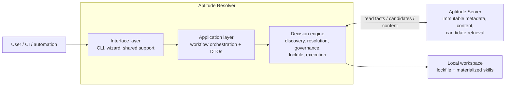

# Aptitude Resolver


[![DeepWiki](https://img.shields.io/badge/Ask-DeepWiki-0A66C2?style=for-the-badge&logo=data%3Aimage%2Fpng%3Bbase64%2CiVBORw0KGgoAAAANSUhEUgAAACAAAAAgCAMAAABEpIrGAAAAsVBMVEVHcEwmWMYZy38Akt0gwZoSaFIbYssUmr4gwJkBlN4WbNE4acofwZkBj9k4aMkBk94WgM0bsIM4aMkewJc2ZMM3Z8cbvIwYpHsewJYAftgBkt0fvpgBkt0cv44cv5wzYckAjtsCk90pasUboXsgwJkfwpYfwJg4aMoct44yXswAkd0BkN84Z8cBktwduZIjcO85lM4hwZo5acoBleA6a88iyaABmOQ8b9QhxZ0CnOoizaOW4DOvAAAAMHRSTlMAKCfW%2FAgWA%2F7%2FDfvMc9j7MU%2Frj3XBcRW%2FJMbe7kUxjI%2FlUzzz6tPQkJ%2BjVmW1oeulmmslAAAByUlEQVQ4y32Tia6jIBSGUVFcqliXtlq73rm3d50ERNC%2B%2F4PNQetoptMeE0PgC%2F9%2FFhCaBSH9Hz2J%2BONgPDl2DolSUWY%2FPL8oEQRCfPxHpFc3Ah5wHoiI6I05NXgjAOgQF3Jn1Dlo4XMPDDes09UE2d%2BREvl3lijBg4CrHNmrbcM2u9u5nwsRcAFfFHFY5sZ607Yua3GqpQiKE6G9cZHZThblZ4T2mLnMxde3ATASMUj72o0Pbs1fADDcLHqAjEDugJ3lC%2BztMGYTADcoLaFyH%2B02DP9%2BWS4ahrXE4laALFKcq8vZfscNY8312mxfr27bLJZjnsYhSDIHmUxLu9h9N%2Fep%2B7pazwoZQw%2B1Nwi33epu7c2p8RooeqCdAHMGoOJIq3CUwIMEniRIaHVe3ZVnO2Vgsh1MstEkQUXVUc%2BjXfk3zbemxS6%2BpQmlPtUeALJ8VKj4JHvAelBqFFdSS3h1SPzQKr%2F%2BaRa0%2B0cCIWtJLauG5U%2FfbgyG01uiNqQhyzA8ddKj1OvK28AsZyN3DKE4X6AEWrU1jJx9N7RFpdPxpHU%2FtMOQG9SjfTp3Yz8KgRVKpfx88Dqhpseq606h%2F%2Bzxfh6LJ8eEDKWbxx9XEDwqzP1SVgAAAABJRU5ErkJggg%3D%3D)](https://deepwiki.com/y0ncha/aptitude-client)


`Aptitude Resolver` is the local decision-making engine in the Aptitude ecosystem. It is a deterministic, package-manager-style resolver for AI skills that turns natural-language requests or existing lockfiles into governed dependency graphs, lockfiles, execution plans, and local materialization while staying intentionally separate from the server that stores immutable registry facts.

## Overview

- Owns intent interpretation, candidate reranking, version selection, dependency solving, governance, lock generation, execution planning, and local materialization.
- Does not own registry storage, immutable metadata, immutable content, indexed candidate retrieval, or published checksum facts. Those remain server concerns.
- Exposes a CLI-first interface with a wizard-first default entrypoint for humans and stable command paths for automation and CI.

The core boundary is simple: the server returns facts, the resolver makes decisions.

## System Design



The resolver is organized as a layered local system. The interface layer owns the human CLI, wizard routing, rendering, and error presentation. The application layer wires workflows and DTO boundaries. The decision engine owns discovery shaping, deterministic resolution, governance, lock generation, and execution planning. The server is a read boundary, not a decision-maker.

- Interface layer: Typer commands, wizard flows, help/manifest text, prompt handling, and user-facing error formatting.
- Application layer: workflow orchestration and stable request/result DTOs.
- Decision engine: discovery, reranking, resolution, governance, lockfile handling, and execution planning.
- Registry boundary: immutable metadata and content come from the server; final selection and solving remain local.

Canonical architecture and boundary details live in [docs/architecture/system-overview.md](docs/architecture/system-overview.md) and [docs/architecture/server-resolver-boundary.md](docs/architecture/server-resolver-boundary.md).

## CLI Surface

The current promoted CLI surface is:

- `aptitude install "<query>"`
- `aptitude policy show`
- `aptitude demo`
- `aptitude sync --lock aptitude.lock.json`
- `aptitude manifest`

The current advanced preview surface is:

- hidden `aptitude resolve "<query>"`

Running `aptitude` with no arguments launches the install-first wizard. `install` and `sync` stay as the promoted task commands, `policy show` exposes the effective local client policy and config layers, `demo` provides a presentation-ready walkthrough of the product surface, and `manifest` exposes the complete command and flag surface. `resolve` still exists for preview, debugging, and CI, but it is hidden from normal CLI help.

Representative examples:

```bash
aptitude --help
aptitude install "Postman Primary Skill"
aptitude install "Postman Primary Skill" --json
aptitude demo
aptitude sync --lock aptitude.lock.json
aptitude manifest
uv run python -m aptitude_resolver resolve "Postman Primary Skill"
```

The normative CLI contract lives in [docs/architecture/cli-interface.md](docs/architecture/cli-interface.md).

## How To Install

Requirements:

- Python `3.9+`
- [`uv`](https://docs.astral.sh/uv/)
- access to an Aptitude Server instance

Local development:

```bash
uv sync --extra dev
cp .env.example .env
# set APTITUDE_SERVER_BASE_URL and APTITUDE_READ_TOKEN
uv run python -m aptitude_resolver --help
uv run python -m aptitude_resolver
```

Repo-local command examples:

```bash
uv run python -m aptitude_resolver install "Postman Primary Skill"
uv run python -m aptitude_resolver sync --lock aptitude.lock.json
uv run python -m aptitude_resolver manifest
```

Published usage:

```bash
uv tool install aptitude-resolver
aptitude --help
```

One-off published usage:

```bash
uvx aptitude-resolver@latest --help
```

## Resolver Flows

- `make build` builds the distributable artifacts
- `make build-publish` performs a local token-based publish to PyPI or TestPyPI
- pushing a `v*` tag triggers the trusted publishing workflow
- `uv tool install aptitude-resolver` installs the published package
- `uvx aptitude-resolver ...` runs the published package ephemerally
- `aptitude ...` is the command end users run after installation

## How To Use

For repo-local development, typical usage starts with one of these commands:

```bash
PYTHONPATH=src .venv/bin/python -m aptitude_resolver
PYTHONPATH=src .venv/bin/python -m aptitude_resolver --help
PYTHONPATH=src .venv/bin/python -m aptitude_resolver install "Postman Primary Skill"
PYTHONPATH=src .venv/bin/python -m aptitude_resolver policy show
PYTHONPATH=src .venv/bin/python -m aptitude_resolver demo
PYTHONPATH=src .venv/bin/python -m aptitude_resolver sync --lock aptitude.lock.json
PYTHONPATH=src .venv/bin/python -m aptitude_resolver manifest
```

The no-args entrypoint launches the install-first wizard. Use `install` for fresh planning from a query, `policy show` to inspect the effective local client policy and config layers, `demo` for a guided presentation surface, `sync --lock` for replaying an existing lockfile, and `manifest` for the full capability map. For development, `python -m aptitude_resolver` is the canonical module entrypoint.

For published usage, prefer the installed CLI:

```bash
aptitude --help
aptitude install "Postman Primary Skill"
aptitude policy show
aptitude demo
aptitude sync --lock aptitude.lock.json
aptitude manifest
```

For one-off published usage without installation:

```bash
uvx aptitude-resolver
uvx aptitude-resolver install "Postman Primary Skill"
uvx aptitude-resolver policy show
uvx aptitude-resolver demo
uvx aptitude-resolver sync
```

## What Works Today

- discovery-backed query resolution from human-readable input
- resolver-owned candidate version selection
- deterministic recursive dependency graph resolution
- candidate-policy filtering and graph governance before lock generation
- system, user, and workspace policy loading from `aptitude.toml`
- hard policy CLI overrides for fresh planning
- `aptitude policy show` for effective policy and config-layer inspection
- rich lockfile generation, serialization, parsing, and replay
- lock-driven execution plan generation
- local materialization from either a fresh plan or an existing lockfile
- `sync --lock` as the lock-replay equivalent of `uv sync`
- registry caching and bounded transient retry
- additive telemetry for planning and materialization stages
- deterministic lockfiles for identical logical inputs
- trace output for discovery, selection, resolver, lock, and execution steps

## What Is Still Incomplete

- remote or centrally managed policy services are not implemented
- broader organization-specific rules are not implemented yet
- winner-vs-runner-up explanation still derives from parallel explanation logic instead of directly from reranker output
- `plugins/` extensibility is not implemented yet
- MCP and SDK interfaces are not implemented yet

## Selection, Governance, And Integrity Direction

The canonical architecture now defines these required semantics:

- server provides immutable metadata such as lifecycle, trust, token, size, and checksum facts
- resolver owns policy and candidate selection
- governance is split into:
  - candidate-policy filtering before final ranking and final root selection
  - full graph governance after resolution and before lock generation
- ranking compares only policy-compliant candidates
- phase 1 checksum verification uses server-published `sha256` checksum metadata and fails fast on mismatch

Current code now implements Governance Phase 1, profile-aware ranking, and explainability snapshots. The canonical source of truth for remaining evolution lives under [docs/README.md](docs/README.md).

## Current User Flows

Fresh planning and install:

```text
query
-> interface
-> discovery
-> resolver
-> governance
-> lockfile
-> execution planning
-> materialization or result rendering
```

Lock replay:

```text
lockfile
-> interface
-> lock parse + replay
-> execution planning
-> materialization
```

Lock replay is intentionally shorter. Once a valid lock exists, discovery and dependency solving must not run again.

## Current Registry Contract Used By The Resolver

The resolver currently talks to the live registry through these primary runtime paths:

- `POST /discovery`
- `GET /skills/{slug}/versions`
- `GET /skills/{slug}/versions/{version}`
- `GET /resolution/{slug}/{version}`
- `GET /skills/{slug}/versions/{version}/content`

For backward compatibility, the client still accepts legacy fallback paths for version metadata and content reads.

Use [docs/reference/api-contract.md](docs/reference/api-contract.md) as the canonical route and payload reference.

## Documentation

- [docs/README.md](docs/README.md): documentation index and reading paths
- [docs/architecture/README.md](docs/architecture/README.md): canonical architecture reading order
- [docs/architecture/cli-interface.md](docs/architecture/cli-interface.md): current CLI command, wizard, and rendering contract
- [docs/architecture/server-resolver-boundary.md](docs/architecture/server-resolver-boundary.md): server facts vs resolver decisions
- [docs/architecture/decision-rules.md](docs/architecture/decision-rules.md): hard implementation and boundary rules
- [docs/reference/api-contract.md](docs/reference/api-contract.md): concrete registry contract used by the resolver
- [docs/contributors/README.md](docs/contributors/README.md): contributor workflow docs
- [docs/reference/README.md](docs/reference/README.md): stable technical reference
- [docs/roadmap/README.md](docs/roadmap/README.md): forward-looking technical direction
- [.agents/README.md](.agents/README.md): agent-facing operating context

## Packaging And Publishing

This project ships as a normal Python package built with `uv` and published to PyPI.

- `pyproject.toml` defines the package metadata, dependencies, and both console scripts: `aptitude-resolver` and `aptitude`
- `make build` creates local wheel and sdist artifacts with `uv build --no-sources`
- `make build-publish` performs a local token-based publish to PyPI or TestPyPI
- pushing a `v*` tag triggers `.github/workflows/publish.yml`, which builds and publishes through GitHub Actions trusted publishing

## Development

Common local commands:

```bash
make run
make debug
make lint
make typecheck
make test
make test-cov
```

If you change CLI behavior, architecture, or the server-resolver boundary, update the corresponding docs in the same change rather than treating the README as the only source of truth.
