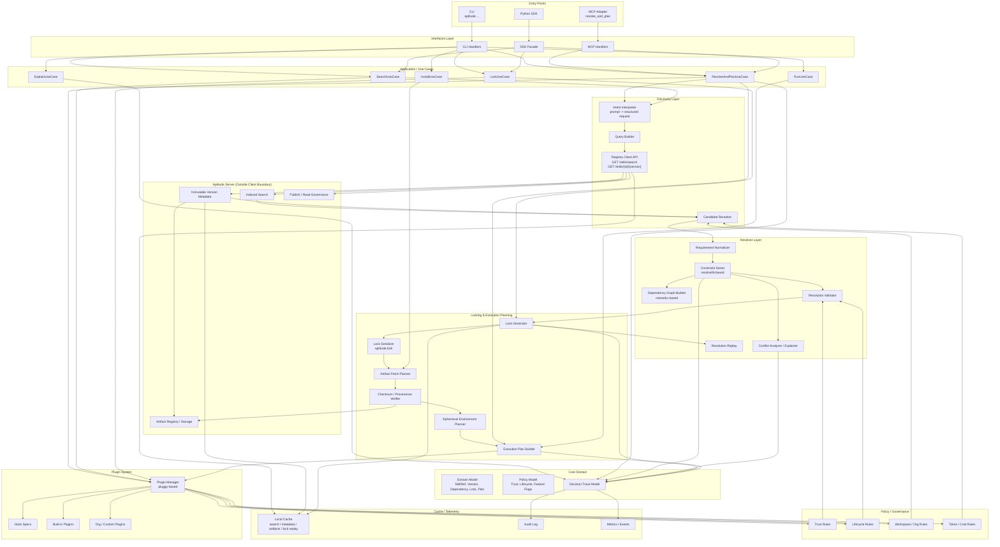
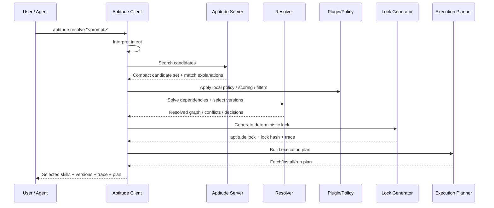

# Aptitude Client Architecture

## Overview

Aptitude is a **dependency and capability management system for AI Skills**, inspired by traditional package managers such as:

- **pip**
- **npm**
- **Maven**
- **uv**

However, instead of managing code libraries, Aptitude manages **AI Skills**.

Skills behave similarly to software packages:

- versioned
- dependency-based
- composable
- discoverable through a registry

The **Aptitude Client** is responsible for:

- interpreting user intent
- discovering candidate skills
- resolving dependencies
- enforcing policies
- generating deterministic locks
- building execution plans

The **Aptitude Server** acts as a registry and discovery system.

---

# Architectural Principles

The architecture follows several key principles.

### 1. Clear Client–Server Separation

**Server responsibilities**

- skill registry
- metadata storage
- indexed search
- artifact hosting
- governance at publish/read time

**Client responsibilities**

- interpret user requests
- rerank candidates
- resolve dependencies
- generate locks
- enforce runtime policies
- create execution plans

---

### 2. Deterministic Resolution

Dependency resolution must be:

- reproducible
- explainable
- deterministic

All execution must rely on **lock files** generated by the client.

---

### 3. Modular Design

The client is organized into clear modules with well-defined responsibilities.

This ensures:

- maintainability
- extensibility
- plugin support
- testability

---

# High Level Architecture

The client pipeline is:

```
User Request
→ Interface
→ Use Case
→ Discovery
→ Resolver
→ Lock Generation
→ Execution Planning
→ Result
```

Each stage has a dedicated module.

---

# Client Module Structure

```
aptitude_client/

  interfaces/
  application/
  domain/
  discovery/
  resolver/
  plugins/
  governance/
  lockfile/
  execution/
  cache/
  telemetry/
  shared/
```

Below is a detailed explanation of each module.

---

# interfaces/

**Purpose**

Expose the Aptitude client to external systems.

This layer contains **no business logic**.

```
interfaces/
    cli/
    mcp/
    sdk/
```

### cli/

Command line interface.

Examples:

```
aptitude resolve "python lint skill"
aptitude search "code formatter"
aptitude install skill-x
```

Built using **Typer**.

---

### mcp/

Adapter for **Model Context Protocol (MCP)**.

Allows AI agents to use Aptitude tools.

Example tool:

```
resolve_and_plan
```

---

### sdk/

Python SDK interface.

Used by applications embedding the Aptitude client.

Example:

```
client.resolve_and_plan(request)
```

---

# application/

The **application layer orchestrates workflows**.

It coordinates components but does not implement core logic.

```
application/
    use_cases/
    commands/
    queries/
    dto/
```

---

### use_cases/

High-level workflows:

Examples:

- ResolveAndPlanUseCase
- SearchUseCase
- InstallUseCase
- LockUseCase
- RunUseCase
- ExplainUseCase

---

### commands/

Write operations triggered by the user.

Examples:

- ResolveCommand
- InstallCommand
- LockCommand

---

### queries/

Read operations.

Examples:

- dependency graph queries
- explanation queries
- search results

---

### dto/

Data Transfer Objects.

Used to move structured data between layers without exposing domain models.

---

# domain/

The **domain layer defines the core concepts of Aptitude**.

It represents the “world” of the system.

```
domain/
    model/
    policy/
    tracing/
    errors/
```

---

### model/

Core entities such as:

- Skill
- SkillVersion
- Dependency
- VersionConstraint
- ResolutionGraph
- LockFile
- ExecutionPlan

---

### policy/

Defines rules such as:

- version compatibility
- lifecycle restrictions
- allowed publishers
- feature flags

---

### tracing/

Tracks decisions made during resolution.

Used for:

- explainability
- debugging
- audit trails

---

### errors/

Domain-specific error types.

Examples:

- DependencyConflictError
- PolicyViolationError
- InvalidVersionError

---

# discovery/

Responsible for finding candidate skills in the registry.

```
discovery/
    intent/
    query_builder/
    registry_api/
    reranking/
```

---

### intent/

Converts user requests into structured search intent.

Example input:

```
"secure python lint skill for CI"
```

Structured output:

```
language: python
category: lint
context: CI
trust_level: high
```

---

### query_builder/

Transforms intent into registry search queries.

Example:

```
GET /skills/search?q=python+lint&trust=high
```

---

### registry_api/

Client for communicating with the Aptitude server.

Endpoints may include:

```
GET /skills/search
GET /skills/{id}/{version}
```

---

### reranking/

Locally reorders candidates based on:

- policy rules
- trust levels
- token cost
- workspace context
- installed state

---

# resolver/

The **resolver is the core engine** of the client.

It selects compatible skill versions and builds dependency graphs.

```
resolver/
    normalizer/
    solver/
    graph/
    conflict/
    validation/
    replay/
```

---

### normalizer/

Converts user requirements into normalized dependency requests.

---

### solver/

Constraint solver.

Responsible for:

- version selection
- dependency expansion
- backtracking when conflicts occur

Often implemented using **resolvelib**.

---

### graph/

Builds a dependency graph representing the resolved system.

Example:

```
Skill A
 ├── Skill B
 └── Skill C
      └── Skill D
```

---

### conflict/

Analyzes dependency conflicts.

Example output:

```
Conflict detected:
Skill A requires B <2.0
Skill C requires B >=2.1
```

---

### validation/

Ensures that the resolved graph complies with:

- governance rules
- lifecycle policies
- compatibility constraints

---

### replay/

Allows lock files to be replayed to reproduce identical environments.

---

# plugins/

Provides extensibility through a plugin system.

```
plugins/
    hookspecs/
    manager/
    builtins/
    custom/
```

---

### hookspecs/

Defines extension points.

Examples:

- score_candidate
- validate_selection
- enrich_lock
- estimate_token_cost

---

### manager/

Loads and executes plugins.

Often implemented using **Pluggy**.

---

### builtins/

Plugins included with the Aptitude client.

---

### custom/

User or organization-specific plugins.

---

# governance/

Enforces security and organizational policies.

```
governance/
    trust/
    lifecycle/
    workspace_rules/
    token_cost/
```

---

### trust/

Verifies:

- publisher identity
- skill signatures
- provenance

---

### lifecycle/

Handles lifecycle states:

- stable
- beta
- deprecated
- archived

---

### workspace_rules/

Organization-specific restrictions.

Examples:

- internal-only skills
- allowlists
- denylists

---

### token_cost/

Rules controlling cost of skill execution.

---

# lockfile/

Responsible for deterministic locking.

```
lockfile/
    model/
    serializer/
    parser/
```

---

### model/

Internal representation of lock files.

---

### serializer/

Writes lock files.

Example:

```
aptitude.lock
```

---

### parser/

Reads existing lock files.

---

# execution/

Transforms a resolved dependency graph into a runnable plan.

```
execution/
    fetch/
    verify/
    environment/
    planner/
```

---

### fetch/

Downloads skill artifacts.

---

### verify/

Validates:

- checksums
- signatures
- provenance

---

### environment/

Creates isolated runtime environments.

Similar to ephemeral environments in **uv**.

---

### planner/

Builds the execution plan.

Example steps:

```
1. fetch artifacts
2. verify integrity
3. prepare runtime
4. activate plugins
5. run skills
```

---

# cache/

Improves performance by caching frequently used data.

```
cache/
    search/
    metadata/
    artifact/
    replay/
```

---

### search/

Caches registry search results.

---

### metadata/

Caches skill manifests.

---

### artifact/

Caches downloaded artifacts.

---

### replay/

Caches resolution results.

---

# telemetry/

Provides observability into the system.

```
telemetry/
    audit/
    metrics/
    events/
```

---

### audit/

Security and compliance logs.

Example:

```
Skill selected: lint-skill
Reason: highest trust score
```

---

### metrics/

Performance monitoring.

Examples:

- resolve time
- plugin execution time
- number of conflicts

---

### events/

Runtime events describing system activity.

Examples:

- search_started
- candidate_selected
- dependency_resolved
- lock_generated

---

# shared/

Common infrastructure used by all modules.

```
shared/
    config/
    utils/
    types/
```

---

### config/

System configuration.

---

### utils/

Shared helper functions.

---

### types/

Shared type definitions.

---

# Full Resolution Flow

The full resolution pipeline looks like this:

```
User Request
      │
      ▼
Interface Layer
      │
      ▼
Application Use Case
      │
      ▼
Intent Interpretation
      │
      ▼
Registry Search
      │
      ▼
Candidate Reranking
      │
      ▼
Dependency Resolution
      │
      ▼
Conflict Analysis
      │
      ▼
Policy Validation
      │
      ▼
Lock Generation
      │
      ▼
Execution Plan Creation
      │
      ▼
Final Result
```

---

# Example Flow

Example command:

```
aptitude resolve "trusted python lint skill"
```

Pipeline:

1. CLI receives command
2. ResolveUseCase starts
3. Intent Interpreter extracts search criteria
4. Registry search returns candidates
5. Client reranks candidates
6. Resolver solves dependencies
7. Policies validate result
8. Lock file is generated
9. Execution plan is built
10. Result returned to the user

**Aptitude Client — Recommended Architecture Diagram**



**Main flow**

