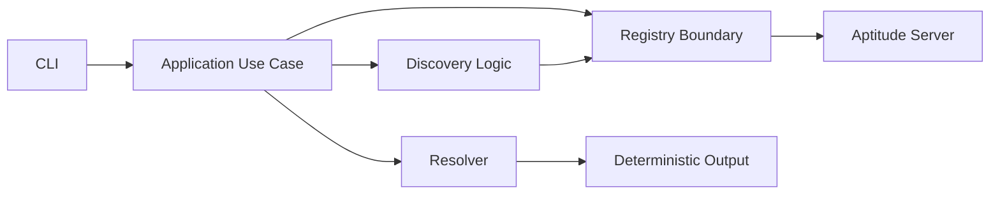

# Aptitude Client Architecture

## Overview

Aptitude Client is a deterministic package-manager-style client for AI skills.

The system is split into two cooperating products:

- Aptitude Server: the registry and retrieval system
- Aptitude Client: the decision engine and execution planner

The client is responsible for:

- interpreting user intent
- discovering candidate skills
- reranking candidates using client context
- resolving dependencies deterministically
- generating reproducible outputs
- growing into lock generation and execution planning over time

The server is responsible for:

- registry search
- immutable skill version storage
- exact metadata reads
- content reads
- publish and lifecycle governance at the API boundary

## Core Design Principles

### 1. Clear client-server separation

The server stores and serves immutable facts.

The client decides what to do with those facts.

That means:

- the server returns candidates, metadata, and dependency declarations
- the client selects, explains, and shapes deterministic outcomes

### 2. Stable boundaries before broad capability

The first slice should be narrow in functionality, but it should still sit on
the real product boundaries.

That is why Aptitude Server communication lives in `registry/`, not in `discovery/`.

### 3. Deterministic behavior

For the same request and the same registry state, the client should produce the
same outcome.

Tie-break rules and ordering rules must always be explicit.

### 4. Layered architecture

Each layer has one main job and a narrow dependency surface.

## Current Product Foundation

Current package structure under `src/aptitude_client/`:

```text
aptitude_client/
  application/
    dto/
    use_cases/
  discovery/
    intent/
  domain/
    errors/
    models/
  interfaces/
    cli/
  registry/
  resolver/
    solver/
  shared/
    config/
    logging/
```

This is the real foundation of the product today.

## Module Responsibilities

### interfaces/

Purpose:
- parse input
- validate external input shape
- call application use cases
- format output
- set process exit codes

Examples:
- CLI
- later MCP entrypoints
- later SDK facade

This layer must stay thin.

### application/

Purpose:
- orchestrate use cases
- sequence workflows
- compose discovery, registry, and resolver operations
- shape user-facing results

This layer owns workflow, not transport details.

### discovery/

Purpose:
- interpret user intent
- build discovery requests
- shape or rerank candidates
- orchestrate discovery-specific flows through the registry boundary

This layer does not own generic server transport.

### registry/

Purpose:
- own all communication with Aptitude Server
- inject auth
- know endpoint paths
- parse request and response payloads
- translate server error envelopes into client-owned errors
- map transport payloads into client-owned models

This is the anti-corruption layer between the client and the server.

### resolver/

Purpose:
- own deterministic selection and dependency logic
- expand dependencies
- validate resolved outcomes
- grow into lock and replay behavior over time

In the first slice, this layer is intentionally small, but it remains the
right long-term home for deterministic solving behavior.

### domain/

Purpose:
- define core concepts
- hold invariants
- define client-owned errors
- keep business meaning independent of transport and interface concerns

### shared/

Purpose:
- config loading
- logging setup
- generic cross-cutting helpers

`shared/` must not become a feature graveyard.

## Dependency Direction

Allowed:

- `interfaces -> application`
- `application -> domain | discovery | registry | resolver | shared`
- `discovery -> registry | domain | shared`
- `registry -> domain | shared`
- `resolver -> domain | shared`

Forbidden:

- `domain -> application | discovery | registry | resolver | interfaces`
- `interfaces -> registry` for business-logic bypass
- `interfaces -> discovery` for business-logic bypass
- `shared -> application | discovery | registry | resolver`

## Why `registry/` Is Separate From `discovery/`

`discovery` is a product behavior.

`registry` is an infrastructure boundary.

They overlap in some workflows, but they are not the same responsibility.

Examples:

- `POST /discovery` is discovery-related
- `GET /skills/{slug}/versions/{version}` is not discovery-related
- `GET /resolution/{slug}/{version}` is not discovery-related
- publish and lifecycle endpoints are not discovery-related

If all of those lived under `discovery/`, the module name would stop matching
its real responsibility. Separating `registry/` keeps the product architecture
clean as the client grows.

## Current Executable Flow

The current hard-cut implementation path is:

```text
CLI -> application -> registry -> resolver -> output
```

That exact-coordinate flow is intentionally narrow because the runtime-tested
server contract is currently strongest there.

## Later Discovery-Driven Flow

Once the discovery contract is aligned, the client grows into:

```text
CLI -> application -> discovery -> registry -> resolver -> lock -> plan
```

That is an expansion of capability on top of the same stable boundaries, not a
replacement of them.

## Growth Path

As the product grows:

- `registry/` can add discovery, content, publish, and lifecycle clients
- `discovery/` can add query building and reranking components
- `resolver/` can add graph solving, conflict explanation, and replay
- `application/` can add more use cases without owning transport logic
- `interfaces/` can later expose MCP and SDK surfaces

The important rule is to grow inward from stable boundaries, not to let every
new feature redefine them.

## Architecture Diagram



## Short Version

The architecture vision is:

- Aptitude Server is the registry system
- Aptitude Client is the deterministic decision engine
- `registry/` is the dedicated boundary to the server
- `discovery/` remains discovery logic, not generic transport
- the MVP is small in behavior, but built on the real product structure
