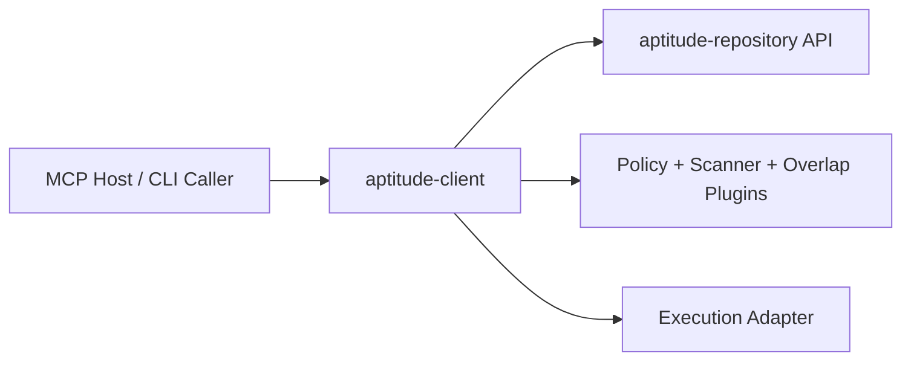
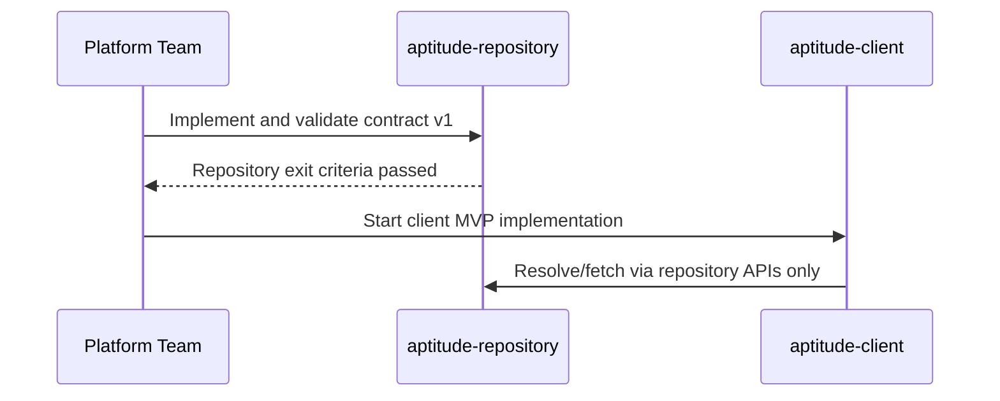

# Aptitude Client PRD

## 1. Executive Summary

- **Problem Statement**: Agent runtimes need a dedicated runtime-facing service that converts prompt/tool requests into executable skill bundles with deterministic planning and policy checks.
- **Proposed Solution**: Define `aptitude-client` as the MCP/CLI orchestration layer that normalizes requests, calls `aptitude-repository` APIs, applies pluggable policy/scanner/selection components, and returns execution plans.
- **Success Criteria**:
  - End-to-end `tool_call -> execution_plan` p95 <= 800 ms with warm cache and bundles <= 100 skills.
  - CLI and MCP produce identical selected bundle hash for equivalent input >= 99.9% of runs.
  - Plugin chain failure isolation: >= 99% of plugin failures do not crash client process.
  - 0 direct writes from client to repository persistence layers (API-only interaction).
  - Security scanner plugin blocks 100% of known-deny signatures in validation test set.
- **In Scope**: Runtime request normalization, repository API consumption, plugin orchestration, execution-plan assembly, and client-local caching/observability.
- **Out of Scope**: Artifact publication/storage, canonical dependency graph persistence, and repository governance policy authoring.
- **Related PRD**: Repository ownership and API contracts are defined in [`repository-prd.md`](./repository-prd.md).

## 2. User Experience & Functionality

- **User Personas**:
  - Agent/application developer invoking skill resolution through CLI or MCP.
  - Security engineer enforcing pre-execution checks.
  - Platform engineer extending client behavior with plugins.

- **User Stories**:
  - As an agent developer, I want to send a prompt/tool call and receive the best executable skill bundle so that I can run tasks without manual dependency assembly.
  - As a security engineer, I want to plug in scanners and policy checks so that unsafe or non-compliant bundles are blocked before execution.
  - As a platform engineer, I want overlap scoring against currently loaded skills so that redundant capabilities are avoided.
  - As an operator, I want full trace output from request to selected bundle so that failures are diagnosable.

- **Acceptance Criteria**:
  - Client exposes both MCP tool and CLI command with consistent request/response schema.
  - Client calls repository resolve endpoints and never bypasses repository policy gates.
  - Plugin interface supports pre-resolve, post-resolve, and pre-execution hooks.
  - Overlap scorer plugin can compare candidate bundles with active runtime skill set and return deterministic exclusion recommendations.
  - On plugin failure, client returns structured degradation/failure reason without corrupting state.
  - Client output includes `ResolvedBundle`, plugin decisions, and execution plan trace ID.

- **Non-Goals**:
  - Acting as authoritative skill artifact source of truth.
  - Maintaining long-term graph metadata or artifact persistence.
  - Replacing repository governance, trust, or versioning rules.

## 3. AI System Requirements (If Applicable)

- **Tool Requirements**:
  - Input adapters: MCP server and CLI command surface.
  - Repository client SDK/API for resolve/download/report operations.
  - Plugin runtime interface for scanners, overlap scorers, policy extensions, and execution adapters.
  - Local cache for resolved bundles/artifacts with TTL and hash validation.
  - Observability hooks for traces, metrics, and structured logs.

- **Evaluation Strategy**:
  - Request quality benchmark: percentage of prompts mapped to expected skill families on labeled dataset.
  - Latency/load tests for MCP and CLI paths independently and combined.
  - Plugin reliability tests: fail-open/fail-closed behavior by plugin policy class.
  - Regression suite ensuring identical resolution outcome for same input/context and repository snapshot.

## 4. Technical Specifications

- **Architecture Overview**:
  - `MCP/CLI Interface` -> `Request Normalizer` -> `Repository Client` -> `Plugin Orchestrator` -> `Execution Planner` -> `Runtime Adapter`.
  - Client is a coordination layer and plugin machine that consumes repository contracts and does not persist authoritative artifact metadata.

- **Integration Points**:
  - Repository APIs: resolve, fetch bundle/artifacts, metadata/report retrieval.
  - Authentication: service token for client-to-repository calls; optional user identity passthrough for audit context.
  - Plugin integrations: local process plugins in MVP; remote plugin transport optional in later versions.
  - Runtime integrations: MCP host applications, CI pipelines, local developer terminals.

- **Security & Privacy**:
  - Scoped credentials and least-privilege API access.
  - Configurable plugin isolation level (subprocess boundary in MVP for untrusted plugins).
  - Prompt and execution trace retention policy with redaction support for sensitive fields.
  - Signed plugin manifests for trusted plugin loading in enterprise mode.

## 5. Risks & Roadmap

- **Phased Rollout**:
  - **MVP**: CLI + MCP interface, repository resolve integration, core plugin hooks, basic trace logging.
  - **v1.1**: security scanner plugin pack, overlap scoring plugin, cache controls, richer policy modes.
  - **v2.0**: distributed plugin execution, multi-repo federation support, policy marketplace.

- **Technical Risks**:
  - Plugin-chain latency can dominate end-to-end SLA without strict hook budgets.
  - Client/repository schema drift can break deterministic behavior across versions.
  - Overlap-scoring heuristics may suppress needed capabilities if benchmark coverage is weak.
  - Excessive local caching can serve stale decisions without robust invalidation.

## 6. Boundary Contract & Exit Criteria

- **Repository Dependency Contract (Input to Client)**:
  - Client integrates through repository versioned APIs/SDK contracts only, as defined in [`repository-prd.md`](./repository-prd.md).
  - Client treats `ResolvedBundle`, `ResolutionReport`, error taxonomy, and `repo_state_id` as source-of-truth inputs.
  - Client must not read or write repository DB tables, artifact storage, or internal services directly.

- **Client Exit Criteria (After Repository Gate)**:
  - Repository exit criteria from [`repository-prd.md`](./repository-prd.md) are fully met before client MVP build starts.
  - Contract compatibility tests pass against repository `v1` fixtures in CI.
  - Client failure handling is proven: repository/API/plugin errors return structured degradation output with trace IDs.
  - End-to-end SLA is met (`tool_call -> execution_plan` p95 <= 800 ms under target bundle size).
  - Architecture guardrails are enforced (lint/tests preventing repository persistence-layer coupling).

## Assumptions to Confirm

- Client is stateless by default except for bounded local cache.
- Initial plugin model is in-process/subprocess Python interface before remote plugin protocol.
